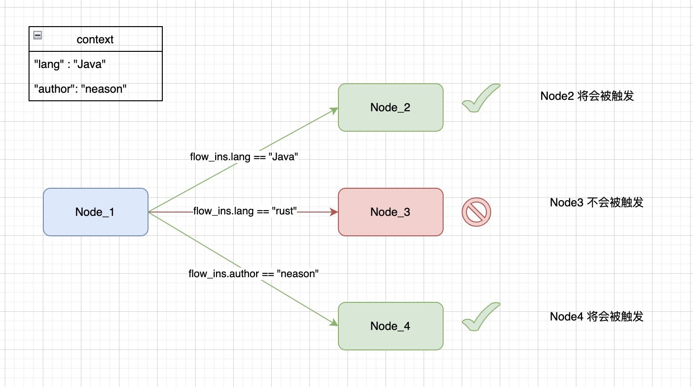

<div align="center">
<h1>JFlow: 超轻量级流程编排引擎平台</h1>
</div>

## 核心概念
之所以称为`平台`，相比于`框架`，JFlow提供了统一的数据持久化功能。

### xxxSpec && xxxInstance
`Spec`:流程引擎核心对象的定义，包含了这个对象必要的参数以及定义其行为。
`Instance`:基于`Spec`生成的实例对象，将`Spec`中定义的参数和行为或参数进行实例化。

### FlowSpec
用于描述整个任务流向，包含节点的定义`NodeSpec`和边的定义`EdgeSpec`。
### NodeSpec
除了`开始节点`和`结束节点`外，节点用于描述当流程实例推进当前节点该做什么事情。
### EdgeSpec
用于串联不同的节点`NodeSpec`，在`EdgeSpec`中配置了相应的表达式，用于控制流程的走向，当一个节点结束后，会尝试运行该
节点所有的后置的边，其表达式返回值为`true`的边的后置节点才会触发。


### TaskSpec
一个`NodeSpec`含有一个`TaskSpec`,用于描述该节点的具体行为，`TaskSpec`也会根据业务实际情况分为同步和异步的任务。
### ActionSpec
用于描述一个具体的操作，可以是本地操作，也可以是远程调用。

## 特性
### 基础流程特性
#### 流程图
- 多版本管理（草稿，发布，归档）
- 设计器（前端，急缺小伙伴参与！！！）
#### 流程实例
- 创建，强制停止流程实例
- 跳过，触发，回调，重试，取消某一个流程实例节点
- 子流程
- 定时调度（基于某一个流程图定时创建一个流程实例）
- 节点相关：失败自动结束流程实例，自动执行，手动执行，自动触发，自动重试等

### 表达式脚本
表达式脚本借助于alibaba开源的[QLExpress](https://github.com/alibaba/QLExpress)实现。
流程引擎将QLExpress用于以下场景：
- 变量替换
- 特性开关控制
- 上下文处理
- Action结果处理（转换）

### 动态
在一个流程图中，节点自身包含很多特性，如是否自动执行，是否自动跳过，这样的特性在复杂场景下是不够的，比如同一个流程图的同一个节点，
想在不同的流程实例中有不同的表现行为，比如在A实例中自动执行，在B实例中需要手动执行，那么可以借助上面的表达式脚本实现，基于不同实例
的上下文数据不一样，可以在节点初始化时赋予不同的值。
```QLExpress
#!script return flow_ins.autoSkip
```
在不同流程实例中，autoSkip变量的值不一样，其表现行为就会不一样。

### AOP
在流程引擎使用时，用户常常有这样的诉求：在流程开始时通知或发个消息，在流程结束关闭一些资源，发一下通知；或在某个任务执行前校验下权限，执行后打印日志。
这些诉求如果是在编写代码时，容易想到的是使用AOP技术来增强，流程引擎将这种概念用编排配置的方式进行实现。


### 扩展性
#### Action
流程引擎将一个操作单元或操作步骤抽象为Action，流程引擎内置基础的Action，使用方也可以自己实现自己的基础Action，
也可以将基础的Action包装为业务Action再供外部使用，内置的Action如下：
- HttpAction: HTTP远程调用
- DubboAction: Dubbo RPC调用
- BeanAction: SpringBean的某个方法调用
- KafkaAction: Kafka消息发送
- SubFlowAction: 创建一个子流程实例

#### Spi
流程引擎将自己的核心依赖抽象为SPI，目的是将这些能力独立为可替换的模块，比如：
- cache: 缓存
- scheduler: 定时调度
- script: 脚本语言
- storage: 存储

## 使用